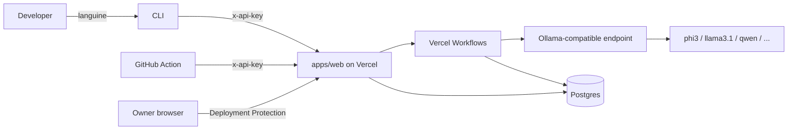

<p align="center">
  
</p>

# Languine

**Self-hosted AI localization with Vercel + Ollama.** Click Deploy. Run `npx languine`. That's it.

---

## One-click deploy

[](https://vercel.com/new/clone?repository-url=https%3A%2F%2Fgithub.com%2Flanguine-ai%2Flanguine&project-name=languine&repository-name=languine&root-directory=apps%2Fweb&env=LANGUINE_API_KEY,AI_MODEL,OLLAMA_BASE_URL,OLLAMA_API_KEY&envDescription=LANGUINE_API_KEY%20is%20a%20random%20token%20you%20pick%20(e.g.%20%60openssl%20rand%20-hex%2032%60).%20AI_MODEL%20is%20optional%20(default%20phi3).%20OLLAMA_BASE_URL%20should%20point%20to%20your%20Ollama-compatible%20endpoint.&envLink=https%3A%2F%2Fgithub.com%2Flanguine-ai%2Flanguine%23environment-variables&stores=%5B%7B%22type%22%3A%22postgres%22%2C%22productSlug%22%3A%22neon%22%7D%5D&demo-title=Languine&demo-description=Self-hosted%20AI%20localization%20with%20Ollama%20for%20your%20own%20deployment&demo-image=https%3A%2F%2Fraw.githubusercontent.com%2Flanguine-ai%2Flanguine%2Fmain%2Fapps%2Fweb%2Fsrc%2Fapp%2Fopengraph-image.png&demo-url=https%3A%2F%2Flanguine.ai)

What the button does:

1. Forks this repo to your GitHub account.
2. Creates a Vercel project with `apps/web` as the root.
3. Provisions serverless Postgres via the Vercel Marketplace — `DATABASE_URL` is auto-injected.
4. Prompts you for `LANGUINE_API_KEY` plus the Ollama settings your deployment should use.
5. Builds and deploys. The build automatically runs `drizzle-kit migrate` against your fresh database.

After the first deploy, do these two things:

1. **Enable Deployment Protection.** In your Vercel project: *Settings → Deployment Protection* → turn on **Vercel Authentication** (or **Password Protection**). This gates the dashboard and `/cli/token`. Without this, your API key is publicly visible.
2. **Open the dashboard** (`https://<your-deployment>.vercel.app`). It shows a status checklist and ready-to-paste CLI commands.

Set `OLLAMA_BASE_URL` to a reachable Ollama-compatible endpoint. For local development the default is `http://127.0.0.1:11434/v1`; for a hosted deployment, use an internal URL the app can reach.

## Use the CLI

> The self-hosted CLI ships under the `selfhosted` npm dist-tag so it doesn't disturb users still pointed at the legacy hosted backend. Install it with `npx languine@selfhosted ...` (or pin `"languine": "^4"` in your `package.json`). `npx languine@latest` continues to resolve to the legacy 3.x CLI for the old hosted service.

In any project that needs translations:

```bash
npx languine@selfhosted login --url https://languine.your-team.example.com
npx languine@selfhosted init
npx languine@selfhosted translate
```

`languine login` opens `/cli/token` in your browser. Because Deployment Protection is on, only authorized owners can see the page — copy the API key, paste it into the CLI prompt.

`languine init` creates a project on your deployment via tRPC (`project.create`) and writes the returned `projectId` into `languine.json`. You don't need to provision anything from the dashboard.

For non-interactive use (CI, scripts):

```bash
export LANGUINE_BASE_URL=https://languine.your-team.example.com
export LANGUINE_API_KEY=<the-key-you-set-on-your-deployment>
npx languine@selfhosted translate
```

## GitHub Action

```yaml
name: Languine
on:
  push:
    branches: [main]

jobs:
  translate:
    runs-on: ubuntu-latest
    permissions:
      contents: write
      pull-requests: write
    steps:
      - uses: actions/checkout@v4
      - uses: languine-ai/languine@v4
        with:
          api-key: ${{ secrets.LANGUINE_API_KEY }}
          base-url: ${{ vars.LANGUINE_BASE_URL }}
          project-id: prj_xxxxxxx
          create-pull-request: 'true'
```

## Environment variables

| Variable | Required | Source | Description |
| --- | --- | --- | --- |
| `LANGUINE_API_KEY` | Yes | Set at deploy | Single API key shared between the dashboard, CLI and Action. Generate with `openssl rand -hex 32`. |
| `DATABASE_URL` | Yes | Auto-injected | Postgres connection string from the Vercel Marketplace integration you picked at deploy. |
| `AI_MODEL` | No | Set at deploy | Ollama model slug. Defaults to `phi3`. Start with `phi3` for low-latency local runs; move to a larger model only if quality is insufficient. |
| `OLLAMA_BASE_URL` | No | Set at deploy / local env | Base URL for an Ollama-compatible endpoint. Defaults to `http://127.0.0.1:11434/v1` in local development. |
| `OLLAMA_API_KEY` | No | Set at deploy / local env | Optional API key sent to the Ollama-compatible endpoint. Defaults to `ollama` when unset. |

## Architecture

- **Hosting:** Vercel (Next.js 16, App Router, Node.js runtime).
- **Database:** Serverless Postgres from the Vercel Marketplace + Drizzle ORM.
- **Background jobs:** Vercel Workflows (`workflow` SDK) — durable, resumable, observable.
- **AI:** Ollama-compatible endpoint (`@ai-sdk/openai-compatible` + AI SDK v6) — single configurable local or remote model.
- **Auth:** Single `LANGUINE_API_KEY` for the CLI/Action; the dashboard is gated by Vercel Deployment Protection.



## Local development

```bash
git clone https://github.com/languine-ai/languine
cd languine
bun install
cp apps/web/.env.example apps/web/.env  # fill in DATABASE_URL etc.
ollama pull phi3
ollama serve
bun dev
```

If your app should talk to a remote Ollama service instead of the default local daemon, set `OLLAMA_BASE_URL` and `OLLAMA_API_KEY` in `apps/web/.env`.

## Runtime choice

For this TypeScript codebase, Ollama is the best performance-oriented fit among the options discussed:

- `Ollama` is the runtime this project now targets directly, with a stable local HTTP API and no extra bridge layer.
- `llamafile` is strong for portability and single-file distribution, but that packaging convenience is not the same as best app-level throughput in this stack.
- `any-llm` is a Python abstraction layer, so it adds the wrong runtime boundary for this Next.js app.
- `TanStack AI` is an application SDK, not a local inference engine.

If your goal is the fastest path to productive local translation in this repo, keep the app on Ollama and start with `phi3`.

## Tests

```bash
bun test                         # everything
bun test --filter @languine/web  # just the web app
bun test --filter languine       # just the CLI
```

## License

[MIT](./LICENSE) © Midday Labs AB